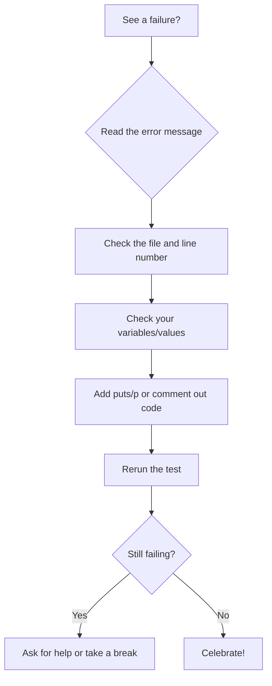

# RSpec:Reading Failures & Debugging Specs: Turning Red into Green (and Laughs)

If you’ve ever seen a wall of red text in your terminal and thought, “Uh oh, what did I break?”—congratulations, you’re a real developer! In this lesson, we’ll demystify RSpec’s output, show you how to read failures, and teach you how to use those failures to become a bug-squashing superhero. We’ll go step by step, with lots of examples, analogies, and encouragement. Debugging is a skill, and you’re about to level up!

---

## Why Reading Failures Matters

Every developer writes code that fails sometimes. (If you don’t, you’re probably a robot. Or lying.) The key is learning how to read those failures, understand what they’re telling you, and use them to fix your code. RSpec’s output is like a treasure map: follow the clues, and you’ll find the bug. Think of failures as your code’s way of waving a little flag and saying, “Hey! Something’s not right here!”

Debugging is not a sign of failure—it’s a sign you’re making progress. Every red message is a step closer to green.

## Visualizing RSpec Output: Red, Yellow, and Green

Here's what RSpec output might look like in your terminal:

```shell
Calculator
  adds two numbers (FAILED - 1)
  subtracts two numbers
  multiplies numbers (PENDING: Not yet implemented)

Failures:

  1) Calculator adds two numbers
     Failure/Error: expect(Calculator.new.add(2, 2)).to eq(5)

       expected: 5
            got: 4

       (compared using ==)
     # ./spec/calculator_spec.rb:4:in `block (2 levels) in <top (required)>'

Finished in 0.01 seconds (files took 0.1 seconds to load)
3 examples, 1 failure, 1 pending
```

**Legend:**

- **Red** = Failure (a test failed)
- **Yellow** = Pending/Skipped (a test is not implemented or was skipped)
- **Green** = Passing (all tests passed)

*Note: Your terminal will show these colors automatically!*

---

## Anatomy of a Failure (Step by Step)

Let’s look at a simple failing spec and break down what RSpec is trying to tell us, one piece at a time.

```ruby
# /spec/recipe_spec.rb
RSpec.describe Recipe do
  it "has a missing ingredient" do
    recipe = Recipe.new("Pancakes")
    expect(recipe.ingredient_names).to include("Milk") # Fix this spec
  end
end
```

If you run this test, you’ll see something like:

```shell
Failures:

  1) Recipe has a missing ingredient
     Failure/Error: expect(recipe.ingredient_names).to include("Milk")

       expected [ ] to include "Milk"
     # ./spec/recipe_spec.rb:5:in `block (2 levels) in <top (required)>'
```

Let’s break it down, line by line:

- **Failures:** This section lists all the tests that didn’t pass. If you see this, don’t panic! It’s normal.
- **1) Recipe has a missing ingredient:** This is the description of the test that failed. It helps you find which example needs attention.
- **Failure/Error:** Shows the exact line of code that failed. This is your starting point for investigation.
- **expected [ ] to include "Milk":** What you wanted vs. what you got. (Oops! Time to check your logic or your data!)
- **File and line number:** Where to look in your code. Open this file, go to this line, and start sleuthing!

Think of the red output as a big, friendly stop sign. It’s not yelling at you—it’s just saying, “Pause! Let’s fix this together.”

---

## RSpec Matcher Variety: Different Matchers, Different Messages

Not all failure messages look exactly the same! RSpec matchers like `eq`, `be`, `include`, and others may produce slightly different output. For example:

```ruby
expect(["Flour", "Egg"]).to include("Milk")
```

Might produce:

```shell
Failure/Error: expect(["Flour", "Egg"]).to include("Milk")
  expected ["Flour", "Egg"] to include "Milk"
```

Reading the matcher-specific message helps you understand exactly what went wrong.

---

## Common Failure Types (With More Examples!)

Let’s look at the most common types of failures you’ll see in RSpec, with extra examples and what to do next.

### 1. Failing Expectations (Red)

This is the most common. Your code didn’t do what you expected. It’s like ordering a pizza and getting a salad—something’s off!

```ruby
# /spec/recipe_spec.rb
expect(Recipe.new("Toast").ingredient_names).to eq(["Bread"]) # Fix this spec
```

If you get a failure, check:

- Did you call the right method? (Maybe you typed `ingredient_names` instead of `ingredients`, or vice versa.)
- Are your arguments correct? (Did you add the right ingredient, or use the correct quantity/unit?)
- Is your expectation accurate? (Are you expecting the right result—does your test match the recipe's actual data?)

Try changing the expectation to something you know will fail, just to see what the output looks like. The more you experiment, the more comfortable you’ll get!

#### Another Example

```ruby
# /spec/recipe_spec.rb
recipe = Recipe.new("Omelette")
recipe.add_ingredient(Ingredient.new("Egg", 2, "large"))
expect(recipe.ingredient_names).to eq(["Egg"]) # Fix this spec
```

### 2. Syntax Errors (Red, but Different)

RSpec will also show you if your Ruby code is invalid. This is like trying to bake a cake with the oven door open—something fundamental is wrong.

```ruby
# /spec/recipe_spec.rb
it "lists ingredient names" do
  recipe = Recipe.new("Pancakes")
  recipe.add_ingredient(Ingredient.new("Flour", 2, "cups"))
  expect(recipe.ingredient_names.to eq(["Flour"]) # Missing closing parenthesis!
end
```

RSpec output:

```shell
SyntaxError:
  unexpected end-of-input, expecting ')'
```

Check your parentheses, commas, and do/end blocks! If you see a SyntaxError, read the message carefully—it usually tells you exactly what’s missing.

#### One More Example

```ruby
# /spec/recipe_spec.rb
it "adds an ingredient" do
  recipe = Recipe.new("Toast")
  recipe.add_ingredient(Ingredient.new("Bread", 1, "slice"))
  expect(recipe.ingredient_names).to eq(["Bread"])
# Oops! Forgot the 'end' for the 'it' block
```

RSpec will complain about an unexpected end-of-input. Always count your `do`/`end` pairs!

### 3. Pending or Skipped Examples (Yellow)

Sometimes you’ll see yellow output. That means you have a pending or skipped test. It’s like putting a sticky note on your code: “Come back to this later!”

```ruby
# /spec/recipe_spec.rb
it "is gluten-free" # No block given, so this is pending
```

Or you can skip a test on purpose:

```ruby
# /spec/recipe_spec.rb
xit "removes an ingredient" do
  recipe = Recipe.new("Toast")
  recipe.add_ingredient(Ingredient.new("Bread", 1, "slice"))
  recipe.remove_ingredient("Bread")
  expect(recipe.ingredient_names).not_to include("Bread")
end
```

Pending tests are a great way to remind yourself (or your teammates) what still needs to be done.

---

## Debugging Hierarchy: A Step-by-Step Flow

Here's a simple flowchart for debugging a failing spec:



---

## Debugging Tips (How to Be a Bug Detective)

Debugging is a skill you build with practice. Here are some tips to help you become a bug detective:

- **Read the error message slowly.** It’s trying to help you! Don’t just skim—read every word.
- **Check the file and line number.** Go straight to the source. Open the file, find the line, and see what’s happening.
- **Print out values with `puts` or `p`.** Sometimes seeing what your variables actually contain is all you need to spot the problem.
- **Comment out code.** If you’re not sure where the problem is, try commenting out parts of your code to narrow it down.
- **Rubber duck debugging.** Explain your code (and the error) out loud, even if it’s just to a rubber duck on your desk. You’ll be amazed how often you spot the issue just by talking it through.
- **Don’t panic!** Everyone gets failures. They’re your friends. Each failure is a clue, not a catastrophe.
- **Google the error message.** Chances are, someone else has seen it before. Stack Overflow is your friend.

---

## Common Beginner Pitfalls

Here are some mistakes almost everyone makes at first:

- Testing the wrong object (e.g., calling a method on the wrong variable)
- Misspelling method names (Ruby won’t warn you—your test just fails!)
- Forgetting to save your file before running the test
- Expecting the wrong value (double-check your math and logic)
- Not reading the full error message (the answer is often right there)

If you hit one of these, don’t worry—you’re learning! Every mistake is a step forward.

Getting stuck is part of the process! Here’s what to do:

1. Take a deep breath. Seriously. It helps.
2. Read the error message again, slowly.
3. Check the file and line number.
4. Try printing out values or adding temporary code to see what’s happening.
5. If you’re still stuck, ask a classmate, instructor, or even your favorite search engine.
6. Take a break and come back with fresh eyes. Sometimes the answer jumps out after a short walk!

## Getting Hands-On

Ready to practice? Here’s how to get started:

1. **Fork and clone this repo to your own GitHub account.**
2. **Install dependencies:**

    ```zsh
    bundle install
    ```

3. **Run the specs:**

    ```zsh
    bin/rspec
    ```

4. **Explore the code:**

   - Most lesson code uses the Recipe and Ingredient domain (see `lib/` and `spec/recipe_spec.rb`).
   - There is also a `spec/debugging_spec.rb` file with a variety of non-recipe, intentionally failing specs. These cover different types of errors and failures you may encounter in RSpec.
   - Review both files for examples of reading and debugging failures.

5. **Read the failures and debug:**

   - Many specs are intentionally written to fail so you can practice reading and fixing RSpec output. Some are obvious, but others are subtle and require careful reading of the failure message. Look for:
     - In `spec/recipe_spec.rb`: missing ingredients, wrong quantities (off-by-one errors), case sensitivity issues, wrong units, logic errors (e.g., expecting a recipe with chicken to be vegetarian)
     - In `spec/debugging_spec.rb`: wrong expectations, NoMethodError, ArgumentError, TypeError, using the wrong matcher, include matcher failures, pending and skipped specs
   - Try to debug and fix each type of failure. Read the comments in the spec files for hints about what to look for and why the test fails.

6. **Implement the pending specs:**

   - Open `spec/recipe_spec.rb` and look for specs marked as `pending`.
   - Implement the real methods in the classes (`lib/recipe.rb`, `lib/ingredient.rb`) as needed so the pending specs pass.

7. **Re-run the specs** to verify your changes!

**Challenge:** Try writing your own spec that fails on purpose, then fix it. Or, introduce a syntax error and see what RSpec shows you. Practice reading and debugging the output until you feel confident!

---

## Resources

- [RSpec Output and Failure Messages](https://relishapp.com/rspec/rspec-core/v/3-10/docs/formatters/documentation-formatter)
- [Debugging Ruby with Pry](https://github.com/pry/pry)
- [Ruby Error Messages Explained](https://www.rubyguides.com/2018/07/ruby-error-messages/)
- [Better Specs: Failures](https://www.betterspecs.org/#fail)

---

## What's Next?

Lab 2 is next! In Lab 2, you'll practice the Red/Green/Refactor cycle by TDD-ing a small Ruby class, like a Playlist, BankAccount, or TodoList. This lab reinforces the TDD principles from this lesson through step-by-step coding exercises, giving you hands-on experience with the workflow of writing, running, and fixing tests.

*Next: You’ll learn how to DRY up your specs with before/after hooks and instance variables!*
